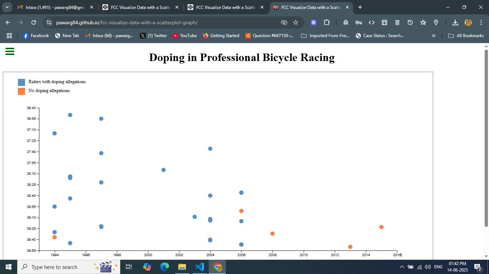

# 📊 FCC: Visualize Data with a Scatterplot Graph

An interactive D3.js-based scatterplot visualization showing doping allegations in professional bicycle racing over time. Built as part of the [freeCodeCamp Data Visualization Certification](https://www.freecodecamp.org/learn/data-visualization/data-visualization-projects/visualize-data-with-a-scatterplot-graph).

> 🛠 Built with **HTML**, **CSS**, **JavaScript**, and **D3.js**

---

## 🔗 Live Demo

👉 [View Project](https://pawarg84.github.io/fcc-visualize-data-with-a-scatterplot-graph/)

---

## 📸 Screenshot



---

## 🚀 Features

- Interactive SVG-based scatterplot
- Hover tooltips for data insight
- Color-coded legend
- Responsive scaling using D3 scales
- Fully functional test suite via FCC script

---

## 🧾 Original CodePen

🔗 [https://codepen.io/ganeshp007/pen/jOoaPYz](https://codepen.io/ganeshp007/pen/jOoaPYz)

---

## 📁 File Structure

```plaintext
.
├── index.html       # Main HTML file
├── style.css        # CSS for styling
├── script.js        # JavaScript for chart rendering
└── README.md        # Project description
